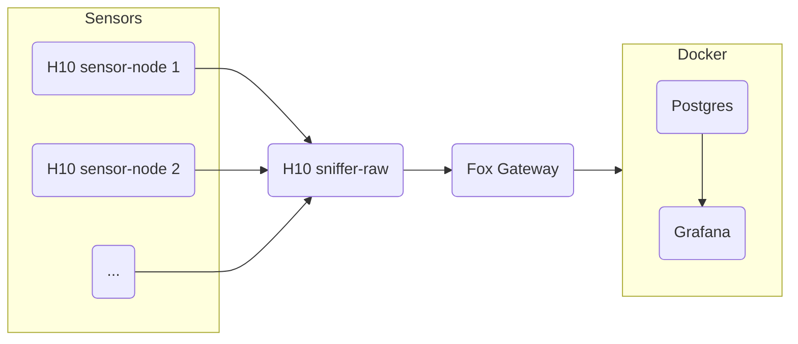

# Visualizer H10-Fox-Docker

The `Visualizer` example is a complete app for visualizing the H10 sensor nodes.

This is an overview of the entire app.

<center>



</center>

In order to visualize through Grafana the sensors' you will need:

- `Sensors`: 1 or more [Berta H10][berta_h10]
- `Sniffer`: 1 [Berta H10][berta_h10]
- `Gateway`: 1 [Fox D27 RoadRunner][fox_d27_roadrunner]
- `Visualizer`: a PC that supports [Docker][Docker]

This will be the Final Directory of our Project

```{ .bash .no-copy }
lora3a-boards/
├── fox_gateway/
├── h10_visualizer/
├── lora3a-boards/
└── RIOT/
```

!!! warning "First follow the [Getting Started][getting_started] guide."

[berta_h10]: https://www.acmesystems.it/h10_berta
[fox_d27_roadrunner]: https://www.acmesystems.it/foxd27
[docker]: https://www.docker.com/
[getting_started]: ../../getting_started.md
